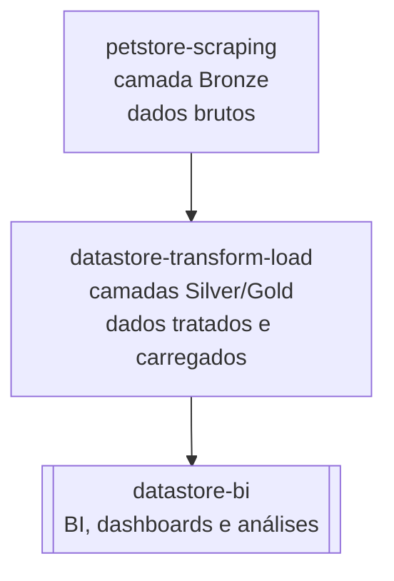

# 🐾 petstore-scraping

Projeto responsável pela **extração de dados** de lojas e franquias do setor pet.
Esta etapa compõe a **camada Bronze** da arquitetura de dados, focada exclusivamente na **coleta bruta e padronização mínima** das informações.

Os dados extraídos por este scraper serão consumidos pelo projeto **`datastore-transform-load`**, que fará o tratamento Silver e Gold, carga no banco de dados, e posterior consumo pelo repositório **`datastore-bi`** para análises e dashboards.

---

## 📌 Descrição

O `petstore-scraping` automatiza a coleta de dados de **franquias do segmento pet**, padronizando apenas o necessário para integração com o projeto de transformação.

O projeto é dividido em **uma camada principal**:

* **🟤 bronze:** coleta de dados brutos diretamente dos sites das franquias (HTMLs e textos sem padronização).

A camada Silver/Gold é responsabilidade do projeto `datastore-transform-load`.

---

## 📊 Estrutura dos dados

Os dados brutos coletados (bronze) podem conter as seguintes colunas mínimas, dependendo da franquia:

| empresa | nome | logradouro | bairro | cidade | estado | cep |
| ------- | ---- | ---------- | ------ | ------ | ------ | --- |

> O Silver/Gold preencherá, corrigirá e padronizará estes campos para análise final.

---

## 🧩 Fluxo de Dados



---

## 🚀 Possíveis usos

* Coleta automatizada de informações de lojas por franquia.
* Base para pipelines de transformação e enriquecimento em `datastore-transform-load`.
* Alimentação de análises e dashboards no `datastore-bi`.

---

## ⚙️ Tecnologias

* [**Selenium**](https://pypi.org/project/selenium/) → automação de navegação e captura de páginas dinâmicas
* [**BeautifulSoup4**](https://pypi.org/project/beautifulsoup4/) → parsing e extração de informações de HTML
* [**lxml**](https://pypi.org/project/lxml/) → processamento rápido de HTML/XML
* [**pandas**](https://pypi.org/project/pandas/) → manipulação e estruturação de dados tabulares

---

## 🏪 Redes suportadas

Atualmente, o projeto coleta dados das seguintes redes:

* **Petz**
* **Cobasi**
* **Petlove**

---

## 🔗 Integração com projetos de transformação

Os arquivos gerados na pasta `data/bronze/` devem ser consumidos pelo projeto **`datastore-transform-load`** para limpeza, padronização e carga no banco de dados.

Exemplo de leitura de CSV bruto:

```python
import pandas as pd

df = pd.read_csv("data/bronze/lojas_bronze.csv", sep=";", encoding="utf-8")
```
