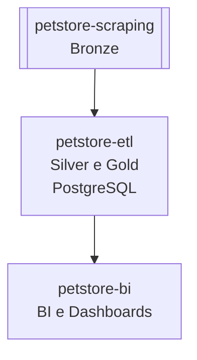

# 🐾 petstore-scraping

Projeto responsável pela **extração de dados** de lojas e franquias do setor pet.

Esta etapa compõe a **camada Bronze** da arquitetura de dados, focada exclusivamente na **coleta bruta** das informações.

Os dados extraídos por este scraper serão consumidos pelo projeto [`petstore-etl`](https://github.com/rafa-trindade/petstore-etl), que fará o tratamento Silver e Gold, carga no banco de dados, e posterior consumo pelo repositório [`petstore-bi`](https://github.com/rafa-trindade/petstore-bi) para análises e BI.

---

## 📌 Descrição:

O `petstore-scraping` automatiza a coleta de dados de **franquias do segmento pet** para integração com o projeto [`petstore-etl`](https://github.com/rafa-trindade/petstore-etl) e executa as seguintes camadas:

* **🟤 Extractc (bronze):** coleta via scraping de dados brutos diretamente dos sites das franquias (HTMLs e textos sem padronização).

A camadas ⚪ Silver e 🟡 Gold serão executadas pelo projeto [`petstore-etl`](https://github.com/rafa-trindade/petstore-etl).

---

## 📊 Estrutura dos Dados e Metadados:

Os dados brutos coletados estão organizados em um **DataFrame** com as seguintes colunas:

| Coluna        | Tipo   | Descrição                   | Valores possíveis / Observações | Unidade | Camada   | Origem           | Última Atualização |
| ------------- | ------ | --------------------------- | ------------------------------- | ------- | -------- | ---------------- | ------------------ |
| empresa       | string | Nome da rede                | Petz, Cobasi, Petlove...        | -       | Bronze   | petstore-sraping | 2025-10-05         |
| nome          | string | Nome da loja                | -                               | -       | Bronze   | petstore-sraping | 2025-10-05         |
| logradouro    | string | Logradouro simplificado     | -                               | -       | Bronze   | petstore-sraping | 2025-10-05         |
| bairro        | string | Bairro                      | -                               | -       | Bronze   | petstore-sraping | 2025-10-05         |
| cidade        | string | Cidade                      | -                               | -       | Bronze   | petstore-sraping | 2025-10-05         |
| estado        | string | Sigla do estado             | SP, RJ, MG...                   | -       | Bronze   | petstore-sraping | 2025-10-05         |
| cep           | string | CEP normalizado             | 00000-000                       | -       | Bronze   | petstore-sraping | 2025-10-05         |
| data_extracao | date   | Data da extração do dado    | DD-MM-AAAA                      | -       | Bronze   | petstore-sraping | 2025-10-05         |

---

## 🧩 Fluxo de Dados:


---

## 📊 Estrutura Geral do Projeto:

| Repositório | Função | Camada | Principais Tecnologias |
| ----------------- | ----------------------------- | ------------------ | -------------------------------------- |
| [`petstore-scraping`](https://github.com/rafa-trindade/petstore-scraping) | Coleta de Dados de Franquias | 🟤 Bronze | Selenium, BeautifulSoup4, lxml, pandas |
| [`petstore-etl`](https://github.com/rafa-trindade/petstore-etl) | Limpeza, Padronização e Carga | ⚪ Silver / 🟡 Gold | requests, SQLAlchemy, pandas, Cep Aberto (API) |
| [`petstore-bi`](https://github.com/rafa-trindade/petstore-bi) | BI e Dashboards | 📊 BI | Streamlit, Plotly, pandas |

---

## ⚙️ Tecnologias e Bibliotecas `petstore-scraping`:

* [**Selenium**](https://pypi.org/project/selenium/) → automação de navegação e interação com páginas dinâmicas  
* [**BeautifulSoup4**](https://pypi.org/project/beautifulsoup4/) → extração e análise de conteúdo HTML  
* [**lxml**](https://pypi.org/project/lxml/) → parser rápido e eficiente para HTML e XML  
* [**pandas**](https://pypi.org/project/pandas/) → manipulação, limpeza e análise de dados tabulares  
* [**tabulate**](https://pypi.org/project/tabulate/) → exibição de dados em formato de tabela no terminal ou relatórios  

---

## 🖥️ Log de Execução `petstore-scraping`:

```text
----------------------------------------------
- Coletando dados da Cobasi...
----------------------------------------------
- Processo concluído. 255 lojas salvas em data/bronze/cobasi_bronze.csv

----------------------------------------------
- Coletando dados da Petcamp...
----------------------------------------------

111 lojas encontradas

Preenchendo Campos Ausentes: 100%|######################################| 111/111

- Processo concluído. 111 lojas salvas em data/bronze/pet_camp_bronze.csv

----------------------------------------------
- Coletando dados da Petland...
----------------------------------------------
- Processo concluído. 132 lojas salvas em data/bronze/petland_bronze.csv

----------------------------------------------
- Coletando dados da Petlove...
----------------------------------------------
- Processo concluído. 14 lojas salvas em data/bronze/petlove_bronze.csv

----------------------------------------------
- Coletando dados da Petz...
----------------------------------------------
- Processo concluído. 264 lojas salvas em data/bronze/petz_bronze.csv

----------------------------------------------
- Coletando dados da Pop Pet Center...
----------------------------------------------

126 lojas encontradas

Preenchendo Campos Ausentes: 100%|######################################| 126/126

- Processo concluído. 126 lojas salvas em data/bronze/pop_pet_bronze.csv

----------------------------------------------
- Unificação de arquivos Bronze...
----------------------------------------------
- Processo concluído. 902 lojas salvas em data/bronze/lojas_bronze.csv
- Data da extração: 10/10/2025

```
🔗 [Ver log completo](https://raw.githubusercontent.com/rafa-trindade/petstore-scraping/refs/heads/main/logs/log.txt)

---

## 🔗 Integração com Projeto de Transformação e Carga

Os arquivos gerados na pasta `data/bronze/` devem ser consumidos pelo projeto [`petstore-etl`](https://github.com/rafa-trindade/petstore-etl) para limpeza, padronização e carga no banco de dados.

---

## 🏪 Redes Analisadas

Atualmente, o projeto coleta dados públicos das seguintes redes para estudo:

* **Cobasi**
* **Petland**
* **Petz**

