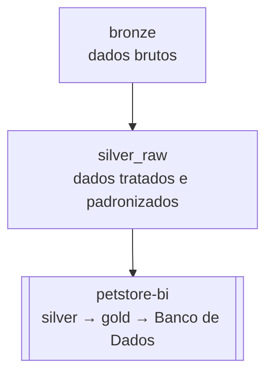

# 🐾 petstore-scraping

Projeto de **scraping** para coletar informações de lojas do setor pet, estruturando os dados em formato padronizado para análise, consulta e integração.  

O projeto segue a arquitetura de dados **bronze → silver_raw**, onde os dados brutos coletados (bronze) são tratados e padronizados (silver_raw) antes de serem disponibilizados para consumo externo.  

Os dados processados por este scraper são consumidos pelo projeto [**`petstore-bi`**](https://github.com/rafa-trindade/petstore-bi), que realiza o enriquecimento, tratamento final e carga no banco de dados.

---

## 📌 Descrição
O `petstore-scraping` automatiza a coleta de dados de **franquias do segmento pet**, padronizando as informações para integração e análise posterior.  

O projeto é dividido em duas camadas principais:  

- **🟤 bronze:** coleta de dados brutos diretamente dos sites das franquias (HTMLs e textos sem padronização).  
- **⚪ silver_raw:** limpeza e padronização dos dados coletados, gerando csv prontos para consumo pelo projeto BI.

---

## 📊 Estrutura dos dados
Os dados padronizados (silver_raw) são salvos com o seguinte formato de colunas:

| empresa | nome | endereco | bairro | cidade | estado | cep | |----------|------|-----------|--------|--------|--------|-----|

---

## 🧩 Fluxo de Dados



---

## 🚀 Possíveis usos
- Consultar todas as lojas de uma franquia específica.  
- Mapear presença de lojas por cidade ou estado.  
- Facilitar análises regionais no projeto `petstore-bi`.  
- Alimentar pipelines de dados e dashboards.

---

## ⚙️ Tecnologias
- [**Selenium**](https://pypi.org/project/selenium/) → automação de navegação e captura de páginas dinâmicas  
- [**BeautifulSoup4**](https://pypi.org/project/beautifulsoup4/) → parsing e extração de informações de HTML  
- [**lxml**](https://pypi.org/project/lxml/) → processamento rápido de HTML/XML  
- [**pandas**](https://pypi.org/project/pandas/) → manipulação e estruturação de dados tabulares  

---

## 🏪 Redes suportadas
Atualmente, o projeto coleta dados das seguintes redes:

- **Petz**  
- **Cobasi**  
- **Petlove**  
- **Petland**

---

## 🔗 Integração com o projeto BI
Os arquivos gerados na pasta `data/silver_raw/` são consumidos diretamente pelo repositório [**`petstore-bi`**](https://github.com/rafa-trindade/petstore-bi) através do link “raw” do GitHub:

```python
url = "https://raw.githubusercontent.com/rafa-trindade/petstore-scraping/main/data/silver_raw/lojas_silver_raw.csv"
df = pd.read_csv(url)
```
